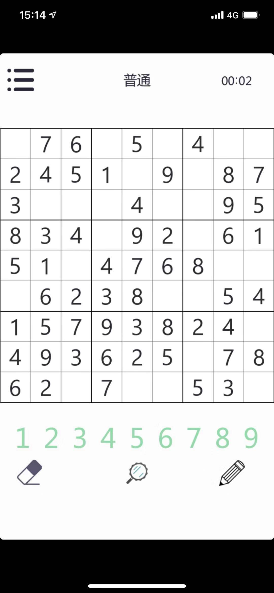

# simple-sudoku

基于opencv简单实现

## Usage

python --image='sudoku1.jpg' --template='123456789.jpg'

## Demo

### input




### Output

```
[['9' '7' '6' '8' '5' '3' '4' '1' '2']
 ['2' '4' '5' '1' '6' '9' '3' '8' '7']
 ['3' '8' '1' '2' '4' '7' '6' '9' '5']
 ['8' '3' '4' '5' '9' '2' '7' '6' '1']
 ['5' '1' '9' '4' '7' '6' '8' '2' '3']
 ['7' '6' '2' '3' '8' '1' '9' '5' '4']
 ['1' '5' '7' '9' '3' '8' '2' '4' '6']
 ['4' '9' '3' '6' '2' '5' '1' '7' '8']
 ['6' '2' '8' '7' '1' '4' '5' '3' '9']]
```

